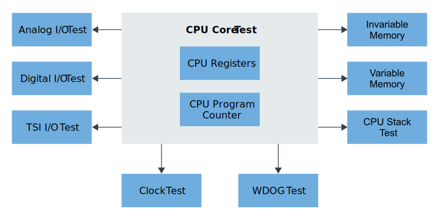

# IEC60730 Safety Standard for Household Appliances
The IEC 60730 safety standard defines the test and diagnostic methods that ensure the safe operation of embedded control hardware and software for household appliances. To achieve functional safety, it's necessary to remove all risk of hazards caused by system malfunction.

## IEC 60730 Class B Safety Library
NXP provide tests of the following components that can be used in application to meet the IEC60730/IEC60335 class B requirements. Our tests are certified by VDE and UL.

## MCU Self-Tests
* CPU Registers and Program Counter - Checks for stuck-at condition
* Analog I/O Test - Checks converted values for analog reference (GND, VREF and Bandgap)
* Digital I/O Test - Checks digital I/O functionality (open circuit, short-circuit to GND, VCC and other I/O)
* TSI Test - Checks converted values for selected electrodes
* Clock Test - Checks oscillator frequency
* WDOG Test - Checks WDOG timeout/clock functionality
* Invariable Memory - Checks CRC memory
* Variable Memory - Checks on-chip RAM for DC faults
* CPU Stack Test - Checks application stack overflow and underflow conditions

## IEC 60730 Categories
The IEC 60730 standard classifies applicable equipment into three categories:

* Class A: Not intended to be relied upon for the safety of the equipment
* Class B: To prevent unsafe operation of the controlled equipment
* Class C: To prevent special hazards

NXP provides IEC 60730 safety class B libraries to help manufacturers of automatic controls in the large appliance market meet the IEC 60730 class B regulation.

These libraries are available in standalone form for use with any supported NXP product or within the MCUXpresso SDK with associated examples for several evaluation boards.